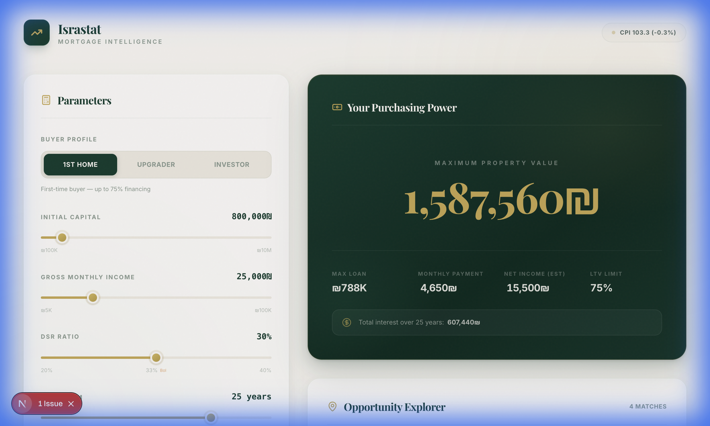
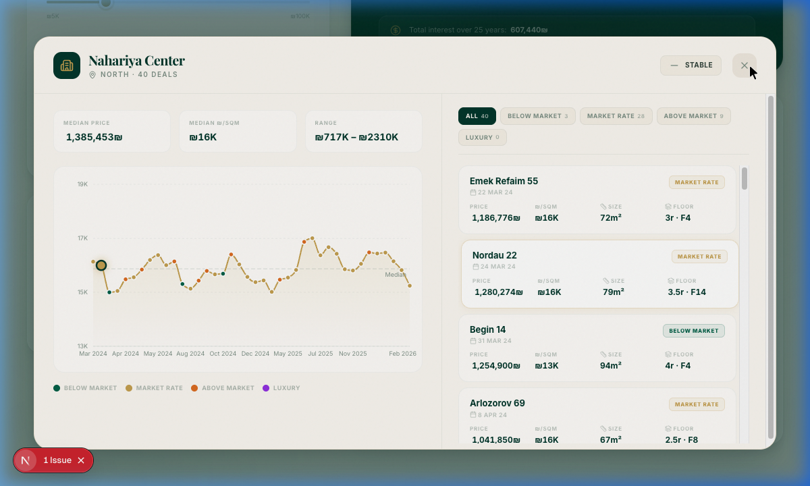

# Israstat · Mortgage Intelligence

> **Immaculate real estate intelligence for the Israeli market.**

Israstat Explorer is a high-end, data-driven platform designed to identify personalized property opportunities across Israel. By intersecting Bank of Israel (BoI) regulations with granular market data, it provides users with a "Purchasing Power" first approach to real estate.

**[→ Live Demo](https://romanzarkhin.github.io/israstat-explorer/)**

---

## 🎨 Visual Identity & UX

Designed with a **"Modern Heritage"** aesthetic, the application prioritizes visual excellence and tactile feedback:

*   **Palette**: A curated trifecta of **English Racing Green**, **Cream**, and **Metallic Gold**.
*   **Typography**: A sophisticated blend of *Playfair Display* (Serif) for headings and *Inter* (Sans) for data nodes.
*   **Interaction**: Micro-animations powered by Framer Motion, noise-overlay textures, and gold micro-glows.

### Interface Preview



---

## ⚡ Core Features

### 🏛️ BoI-Compliant Mortgage Engine
*   **Dynamic Profiles**: Accurate LTV (Loan-to-Value) modeling for **First-time Buyers (75%)**, **Upgraders (70%)**, and **Investors (50%)**.
*   **DSR Monitoring**: Real-time Debt-Service Ratio tracking with visual alerts at the critical **33% threshold**.
*   **Net Income Estimation**: Sophisticated Israeli tax bracket approximations to convert gross income to realistic purchasing power.

### 🔍 Opportunity Explorer
*   **Neighborhood Granularity**: Matches your specific budget to transaction-level data across 17+ high-growth neighborhoods.
*   **Regional Trends**: 6-region growth ribbon displaying annual appreciation and price-per-sqm metrics.
*   **Market Pulse**: Real-time ticker for CPI (Consumer Price Index) and construction cost fluctuations.

### 📊 Deal Analysis Modal
Click any neighborhood card to open an immersive split-view modal:
*   **Trend Chart**: Interactive Recharts area graph with rolling-average trend line, color-coded dots per deal category, and a dashed median reference line.
*   **Category Filters**: Instantly filter by *Below Market*, *Market Rate*, *Above Market*, or *Luxury* classifications.
*   **Deal List**: 40 generated deals per neighborhood — each showing address, date, price, ₪/sqm, size, floor, and category badge.
*   **Hover-to-Highlight**: Hovering a deal card in the list enlarges and glows its corresponding data point on the chart.



### 🎞️ Premium Animation System
*   **Staggered Reveals**: Smooth sequence-based loading for opportunity cards.
*   **Blur-Scale Transitions**: High-fidelity visual feedback on value updates.
*   **Glassmorphism**: Layered depth with backdrop blur and border-glow effects.

---

## 🏗️ Technical Stack

*   **Framework**: [Next.js 16 (App Router)](https://nextjs.org/)
*   **Language**: [TypeScript](https://www.typescriptlang.org/)
*   **Styling**: [Tailwind CSS](https://tailwindcss.com/) + Custom CSS Design Tokens
*   **Charts**: [Recharts](https://recharts.org/)
*   **Animations**: [Framer Motion](https://www.framer.com/motion/)
*   **Icons**: [Lucide React](https://lucide.dev/)

---

## 🚀 Getting Started

### Prerequisites

*   Node.js 20+ 
*   npm or yarn

### Installation

1. Clone the repository
2. Install dependencies:
   ```bash
   npm install
   ```
3. Run the development server:
   ```bash
   npm run dev
   ```

Open [http://localhost:3000](http://localhost:3000) with your browser to explore the intelligence.

---

## 📂 Project Structure

```text
src/
├── app/                   # Next.js Routes & Layouts
│   ├── globals.css        # Premium Design System (CSS Tokens + Modal Styles)
│   └── page.tsx           # Main Interactive Intelligence Dashboard
├── components/
│   └── DealModal.tsx      # Split-View Deal Analysis Modal (Recharts + List)
├── lib/
│   ├── mortgage-engine.ts # BoI Regulatory & Amortization Logic
│   └── deal-provider.ts   # Seeded PRNG Deal Generator & Category Engine
└── data/
    └── market-snapshot.ts  # Filtered Real Estate & Economic Data
```

---

> [!IMPORTANT]
> **Disclaimer**: Israstat Explorer provides estimates based on current Central Bureau of Statistics data. Always consult with a licensed mortgage advisor for final financial decisions.

---

